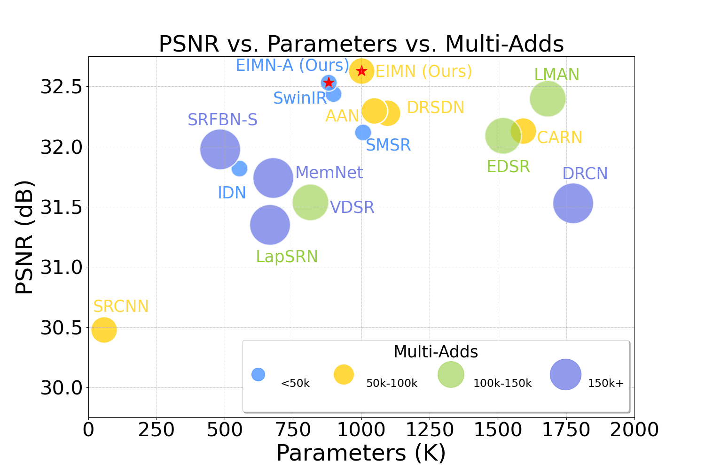
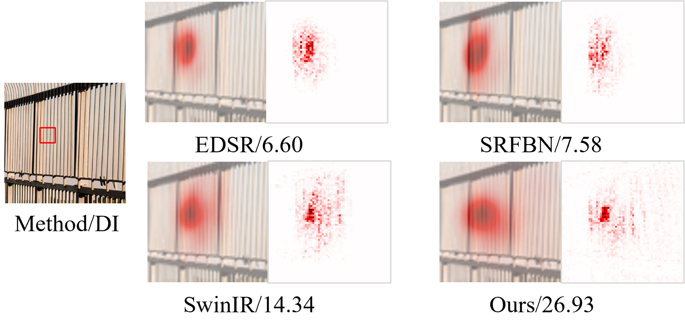
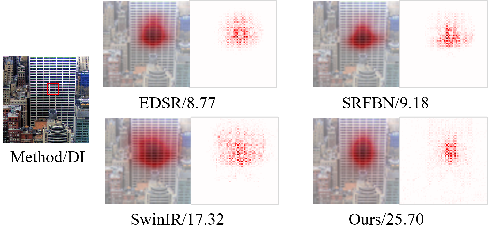
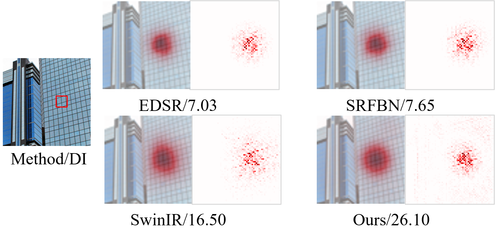
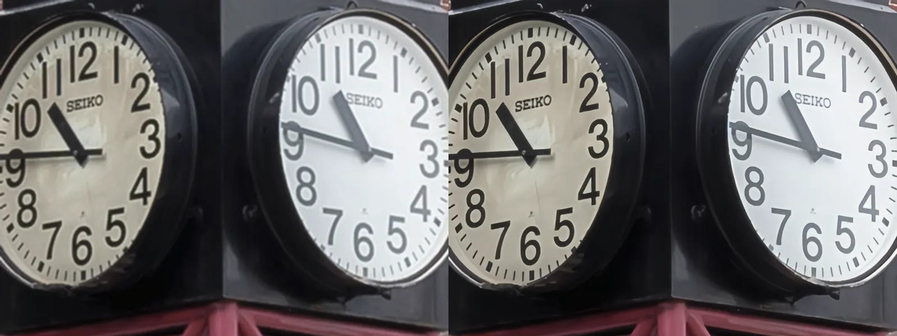
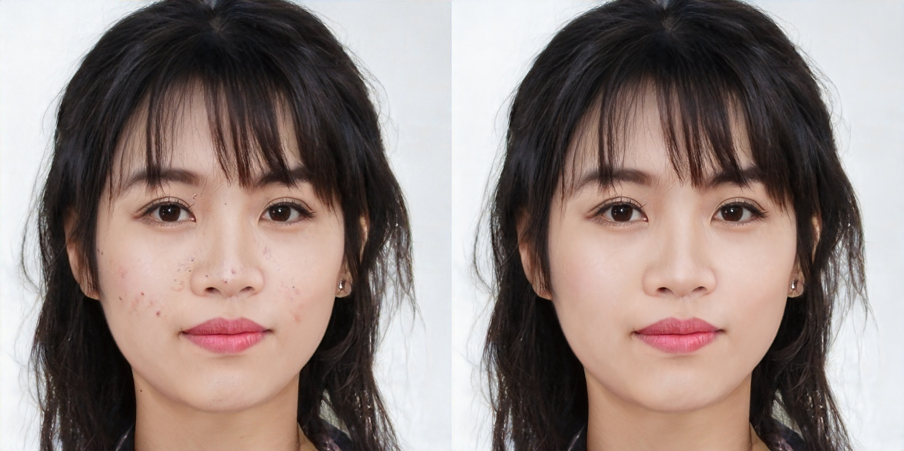
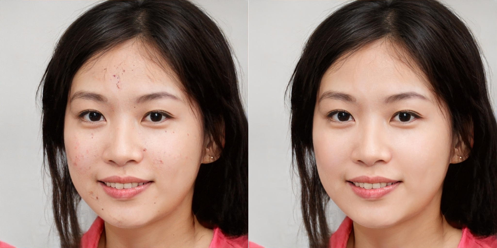

# [ECAI-2023] Efficient Information Modulation Network for Image Super-Resolution
Xiao Liu<sup>1 </sup>, Xiangyu Liao<sup>1 </sup>, Xiuya Shi<sup>1 </sup>, [Linbo Qing](https://scholar.google.com.hk/citations?hl=zh-CN&user=0KRDflwAAAAJ)<sup>1 </sup> and [Chao Ren](https://scholar.google.com.hk/citations?hl=zh-CN&user=Y6OuBMYAAAAJ)<sup>1, *</sup>

<sup>1</sup> Sichuan University,   <sup> *</sup> Corresponding Author

🤗 [paper](https://ebooks.iospress.nl/doi/10.3233/FAIA230435) 😀 [Supplementary materials](https://github.com/liux520/EIMN/blob/main/Docs/supplementary%20material.pdf)



<hr />

## :writing_hand: Changelog and ToDos
- [x] (2024/10/20) We migrate the original [EIMN project](https://github.com/liux520/EIMN) to the BasicSR framework and release more experimental [weights](https://github.com/liux520/EIMN_BasicSR/releases).
<hr />

## :bulb: Abstract


> **Abstract:** Recent researches have shown that the success of Transformers comes from their macro-level framework and advanced components, not just their self-attention (SA) mechanism. Comparable results can be obtained by replacing SA with spatial pooling, shifting, MLP, fourier transform and constant matrix, all of which have spatial information encoding capability like SA. In light of these findings, this work focuses on combining efficient spatial information encoding technology with superior macro architectures in Transformers. We rethink spatial convolution to achieve more efficient encoding of spatial features and dynamic modulation value representations by convolutional modulation techniques. The large-kernel convolution and Hadamard product are utilizated in the proposed Multi-orders Long-range convolutional modulation (MOLRCM) layer to imitate the implementation of SA. Moreover, MOLRCM layer also achieve long-range correlations and self-adaptation behavior, similar to SA, with linear complexity. On the other hand, we also address the sub-optimality of vanilla feed-forward networks (FFN) by introducing spatial awareness and locality, improving feature diversity, and regulating information flow between layers in the proposed Spatial Awareness Dynamic Feature Flow Modulation (SADFFM) layer. Experiment results show that our proposed efficient information modulation network (EIMN) performs better both quantitatively and qualitatively.
<hr />

## :sparkles: Synthetic Image SISR Results
<details>
	<summary><strong>Quantitative Comparison with SOTA</strong> (click to expand) </summary>
    <p></p>
	Quantitative comparison with SOTA methods on five popular benchmark datasets. Blue text indicates the best results. `Multi-Adds' is calculated with a 1280 $\times$ 720 HR image.
</details>
<details>
	<summary><strong>Qualitative Comparison with SOTA</strong> (click to expand) </summary>
    <p></p>
    <p></p>
    <p></p>
    <p></p>
    <p></p>
    <p></p>
    <p></p>
    <p></p>
    <p></p>
</details>
<details>
	<summary><strong>LAM visualization analysis</strong> (click to expand) </summary>
	<p></p>
    <p></p>
    <p></p>
	Results of Local Attribution Maps. A more widely distributed red area and higher DI represent a larger range pixels utilization. 
</details>


<hr />

## :rocket: Installation

This repository is built in PyTorch 1.12.1 and trained on Centos 4.18.0 environment (Python3.7, CUDA11.6, cuDNN8.0). 

1. Clone our repository
```
git clone https://github.com/liux520/EIMN_BasicSR.git
cd EIMN_BasicSR
```
<hr />

## :computer: Usage

### 0. Dataset Preparation

- The dataset for training can be downloaded here [DIV2K](https://data.vision.ee.ethz.ch/cvl/DIV2K/) and [Flickr2K](https://cv.snu.ac.kr/research/EDSR/Flickr2K.tar).

- The dataset for testing can be downloaded here [BasicSR.](https://drive.google.com/drive/folders/1B3DJGQKB6eNdwuQIhdskA64qUuVKLZ9u)

- It is recommended to symlink the dataset root to `Datasets` with the follow command:

  For Linux: `ln -s [Your Dataset Path] [EIMN Project Path/Datasets]` 

  For Windows: `mklink /d [EIMN Project Path\Datasets] [Your Dataset Path]`   (In administrator mode)

- The file structure is as follows:

  ```
  Data
  Datasets
  ├─Benchmark   
  │  ├─Set5
  │  │  ├─GTmod12
  │  │  ├─LRbicx2
  │  │  ├─LRbicx3
  │  │  ├─LRbicx4
  │  │  └─original
  │  ├─Set14
  │  ├─BSDS100
  │  ├─Manga109
  │  └─Urban100
  ├─DF2K
  │  ├─DF2K_HR_train
  │  ├─DF2K_HR_train_x2m
  │  ├─DF2K_HR_train_x3m
  │  └─DF2K_HR_train_x4m  
  ├─DIV2K
  │  ├─DIV2K_HR_train
  │  ├─DIV2K_HR_train_x2m
  │  ├─DIV2K_HR_train_x3m
  │  └─DIV2K_HR_train_x4m  
  Demo
  ...
  ```

### 1. Evaluation
- Download the pretrained weights here and run the following command for evaluation on five widely-used Benchmark datasets.
```python
python demo/test_on_custom_datset.py
```

- If you just want to generate an image, you can run demo.py.
```python
python demo/demo.py
```

### 2. Training

- For example, training the model **EIMN_L** with scale factor 2

```python
python basicsr/train.py -opt options/train/EIMN/train_EIMNNet_x2_bicubic.yml
```

<hr />

## :arrow_double_down: Model Zoo


> #### SISR-1: Bicubic degradation (Train dataset: DF2K-Large-Image)

|   Model   | #Params | FLOPs |     Set5     |    Set14     |   Urban100   |   Manga109   |   BSDS100    |
| :-------: | :-----: | :---: | :----------: | :----------: | :----------: | :----------: | :----------: |
| EIMN_L_x2 |  981K   | 212G  | 38.26/0.9620 | 34.14/0.9227 | 33.23/0.9381 | 39.42/0.9786 | 32.41/0.9034 |
| EIMN_L_x3 |  990K   |  95G  | 34.76/0.9304 | 30.70/0.8490 | 29.05/0.8698 | 34.60/0.9502 | 29.33/0.8127 |
| EIMN_L_x4 |  1002K  |  54G  | 32.63/0.9008 | 28.94/0.7897 | 26.88/0.8084 | 31.52/0.9183 | 27.82/0.7458 |
| EIMN_A_x2 |  860K   | 186G  | 38.26/0.9619 | 34.12/0.9222 | 33.15/0.9373 | 39.48/0.9788 | 32.40/0.9034 |
| EIMN_A_x3 |  868K   |  83G  | 34.70/0.9299 | 30.65/0.8481 | 28.87/0.8660 | 34.45/0.9492 | 29.31/0.8121 |
| EIMN_A_x4 |  880K   |  47G  | 32.53/0.8993 | 28.89/0.7882 | 26.68/0.8027 | 31.22/0.9418 | 27.79/0.7447 |

> #### SISR-2: Bicubic degradation (Train dataset: [Multi-scale DF2K subimages](https://github.com/xinntao/Real-ESRGAN/blob/master/docs/Training_CN.md))

|   Model   | #Params | FLOPs | Set5 | Set14 | Urban100 | Manga109 | BSDS100 |
| :-------: | :-----: | :---: | :--: | :---: | :------: | :------: | :-----: |
| EIMN_L_x2 |  981K   | 212G  |      |       |          |          |         |
| EIMN_L_x3 |  990K   |  95G  |      |       |          |          |         |
| EIMN_L_x4 |  1002K  |  54G  |      |       |          |          |         |
| EIMN_A_x2 |  860K   | 186G  |      |       |          |          |         |
| EIMN_A_x3 |  868K   |  83G  |      |       |          |          |         |
| EIMN_A_x4 |  880K   |  47G  |      |       |          |          |         |


> #### SISR-3:  Bicubic degradation (Train dataset: DIV2K-Large-Image)


|   Model   | #Params | FLOPs |     Set5     |    Set14     |   Urban100   |   Manga109   |   BSDS100    |
| :-------: | :-----: | :---: | :----------: | :----------: | :----------: | :----------: | :----------: |
| EIMN_L_x2 |  981K   | 212G  | 38.22/0.9619 | 33.93/0.9218 | 32.86/0.9354 | 39.21/0.9776 | 32.34/0.9027 |
| EIMN_L_x3 |  990K   |  95G  |              |              |              |              |              |
| EIMN_L_x4 |  1002K  |  54G  |              |              |              |              |              |
| EIMN_A_x2 |  860K   | 186G  |              |              |              |              |              |
| EIMN_A_x3 |  868K   |  83G  |              |              |              |              |              |
| EIMN_A_x4 |  880K   |  47G  |              |              |              |              |              |


> #### SISR-4:  Bicubic degradation (Train dataset: [Multi-scale DIV2K subimages](https://github.com/xinntao/Real-ESRGAN/blob/master/docs/Training_CN.md))


|   Model   | #Params | FLOPs |     Set5     |    Set14     |   Urban100   |   Manga109   |   BSDS100    |
| :-------: | :-----: | :---: | :----------: | :----------: | :----------: | :----------: | :----------: |
| EIMN_L_x2 |  981K   | 212G  | 38.23/0.9619 | 33.96/0.9212 | 32.98/0.9367 | 39.33/0.9783 | 32.36/0.9029 |
| EIMN_L_x3 |  990K   |  95G  |              |              |              |              |              |
| EIMN_L_x4 |  1002K  |  54G  |              |              |              |              |              |
| EIMN_A_x2 |  860K   | 186G  |              |              |              |              |              |
| EIMN_A_x3 |  868K   |  83G  |              |              |              |              |              |
| EIMN_A_x4 |  880K   |  47G  |              |              |              |              |              |


> #### SISR-5:  [Practical degradation model](https://github.com/xinntao/Real-ESRGAN) (Train dataset: DF2K)


<center class="half">


</center>

<center class="half">


</center>

<center class="half">


</center>

<center class="half">


</center>


> #### SISR-6:  [Face Beauty & Acne Removal](https://aistudio.baidu.com/competition/detail/1022/0/introduction) (Train dataset: [here](https://aistudio.baidu.com/competition/detail/1022/0/datasets))

<center class="half">


</center>

<center class="half">


</center>

<center class="half">


</center>

<center class="half">


</center>


<hr />

## :e-mail: Contact
Should you have any question, please create an issue on this repository or contact at liuxmail1220@gmail.com & liaoxiangyu1@stu.scu.edu.cn &shixiuya@stu.scu.edu.cn.

<hr />

## :heart: Acknowledgement
We thank the [XPixelGroup](https://github.com/XPixelGroup) for the excellent low-level vision framework [BasicSR](https://github.com/XPixelGroup/BasicSR).

<hr />

## :pushpin: License
This project is released under the [MIT license](LICENSE).

## :pray: Citation
If this work is helpful for you, please consider citing:

```
@incollection{EIMN,
  title={Efficient Information Modulation Network for Image Super-Resolution},
  author={Liu, Xiao and Liao, Xiangyu and Shi, Xiuya and Qing, Linbo and Ren, Chao},
  booktitle={26th European Conference on Artificial Intelligence (ECAI)},
  pages={1544--1551},
  year={2023},
  publisher={IOS Press}
}

```

